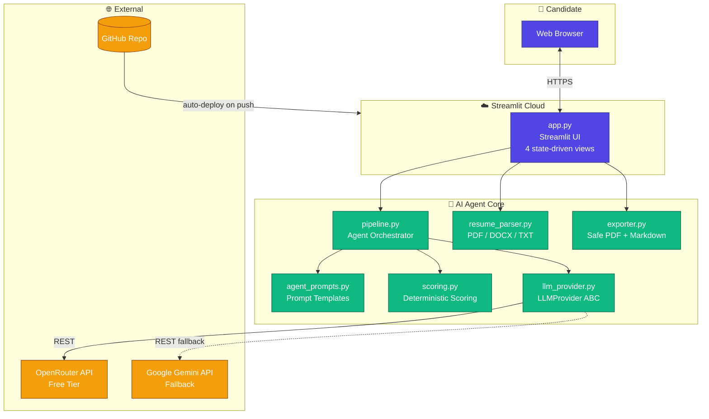
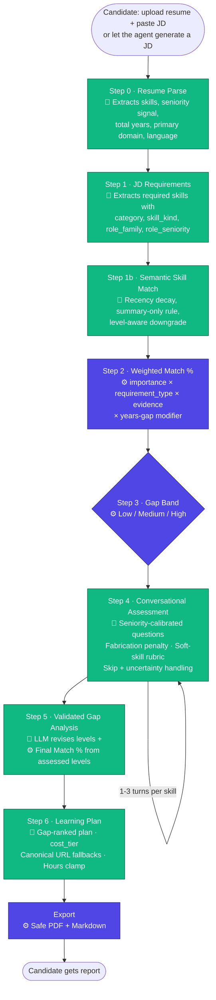

# Architecture

## System Overview



## The AI Agent Pipeline



🤖 = LLM-driven step · ⚙️ = Deterministic code

## Why Each Step Exists

| # | Step | Why it's needed |
|---|------|-----------------|
| 0 | Resume Parse | Structured view of the candidate (skills, seniority, years, domain) enables later calibration |
| 1 | JD Requirements | Structured view of the role (hard vs soft skills, role family, seniority, importance) |
| 1b | Semantic Match | Bridges JD ↔ resume with recency + level awareness — avoids false positives |
| 2 | Weighted Match % | Transparent, reproducible resume-based score the LLM can't fabricate |
| 3 | Gap Band | Quick Low/Medium/High signal for UI and plan prioritisation |
| 4 | Assessment | Validates real proficiency — catches resume inflation and confirms genuine skill |
| 5 | Validated Gaps | Final Match % reflecting what the candidate actually demonstrated |
| 6 | Learning Plan | Actionable, gap-ranked plan with working resources and a realistic time budget |

## Reliability Features

What makes the agent trustworthy, not just generative:

- **Strict JSON schemas** — every LLM step returns JSON validated against an expected shape; malformed output triggers a single retry with a schema reminder
- **Recency decay** — a skill last used 5+ years ago is downgraded one evidence level
- **Summary-only rule** — skills that appear only in a skills list / summary (no backing experience) are capped at `weak` evidence
- **Level-aware match downgrade** — when `required_level` is 4–5 and evidence is only moderate, `semantic_match` downgrades to `adjacent_match`
- **Fabrication penalty** — responses full of buzzwords without how/why/when cap `technical_correctness` at 2 and force `confidence = low`
- **Seniority calibration** — expected proficiency `expected_level` scales from intern=1 → lead=5; follow-ups only fire when `|provisional_level − expected_level| ≤ 1`
- **Soft-skill rubric swap** — for `skill_kind == "soft"` the agent swaps the technical dimensions for `concreteness` / `outcome` / `self_awareness`
- **Canonical URL fallback** — if the LLM omits URLs for a plan item, the pipeline appends a starter resource (docs.python.org, react.dev, kubernetes.io, aws.amazon.com/documentation, etc.) keyed on skill-name keyword match
- **Hours clamp** — every plan item capped at 3–30 h; total plan proportionally scaled to fit 16 weeks of `time_budget_hours_per_week`
- **Safe PDF export** — long URLs/skill names soft-broken into 60-char chunks so `fpdf2.multi_cell` never crashes on unbreakable tokens

## Scoring Logic

### Proficiency Rubric (1–5)

| Score | Label | Meaning |
|-------|-------|---------|
| 1 | Novice | No demonstrated knowledge |
| 2 | Basic Awareness | Recognises terminology, can't apply |
| 3 | Working Knowledge | Can explain and has applied in limited contexts |
| 4 | Strong Proficiency | Deep understanding, solves complex problems |
| 5 | Expert Mastery | Can teach others, architect solutions |

### Weighted Match % (Step 2 — deterministic)

```
score         = base × evidence_modifier × confidence_modifier × years_modifier
weight        = IMPORTANCE_WEIGHTS[importance] + (0.2 if requirement_type == "required")
match %       = Σ(score × weight) / Σ(weight) × 100
```

Years-gap modifier bucket table lives in `core/scoring.py::_years_modifier`.

### Gap Band (Step 3)

| Match % | Band | Icon |
|---------|------|------|
| < 50% | Low | 🔴 |
| 50–75% | Medium | 🟡 |
| > 75% | High | 🟢 |

### Final Match % (Step 5 — deterministic)

After the conversational assessment, the agent computes a second match % using the validated levels:

```
level_ratio        = min(1.0, validated_current_level / required_level)
final_weight       = IMPORTANCE_WEIGHTS[importance] + (0.2 if requirement_type == "required")
final_match %      = Σ(level_ratio × final_weight) / Σ(final_weight) × 100
```

Per-skill `gap_size = max(0, required_level − validated_level)` classifies gaps as `no_gap` / `minor` / `moderate` / `significant`.

## Data Flow (per session)

All state lives in `st.session_state` — no database, no persistence between sessions. The resume + JD never leave the user's Streamlit session except for direct calls to the LLM provider.

```
st.session_state = {
  "step":            "input" | "skill_overview" | "assessment" | "learning_plan",
  "jd_text":         str,
  "resume_text":     str,
  "parsed_resume":   dict,   # Step 0
  "jd_requirements": dict,   # Step 1
  "skill_matches":   dict,   # Step 1b
  "match_results":   dict,   # Step 2 — includes per_skill_breakdown
  "gap_band":        str,    # Step 3
  "assessment_state": dict,  # Step 4 running state (per-skill Q&A)
  "validated_gaps":  dict,   # Step 5 — includes final_match_percentage
  "learning_plan":   dict,   # Step 6 — includes plan_items[] with cost_tier
  "model_name":      str,    # selected OpenRouter model
}
```

## Module Map

| File | Role |
|------|------|
| `app.py` | Streamlit UI — 4 state-driven views (input → skill overview → assessment → learning plan) |
| `core/pipeline.py` | Agent orchestrator — all 9 steps + JD generator |
| `core/agent_prompts.py` | All LLM prompt templates with schema instructions |
| `core/scoring.py` | Deterministic weighted scoring, years-gap modifier, final match %, validated-gaps builder |
| `core/llm_provider.py` | `LLMProvider` ABC + `OpenRouterProvider` + `GeminiProvider` |
| `core/resume_parser.py` | PDF (pdfplumber) / DOCX (python-docx) / TXT parsing |
| `core/exporter.py` | Safe Markdown + PDF export with long-token wrapping |
