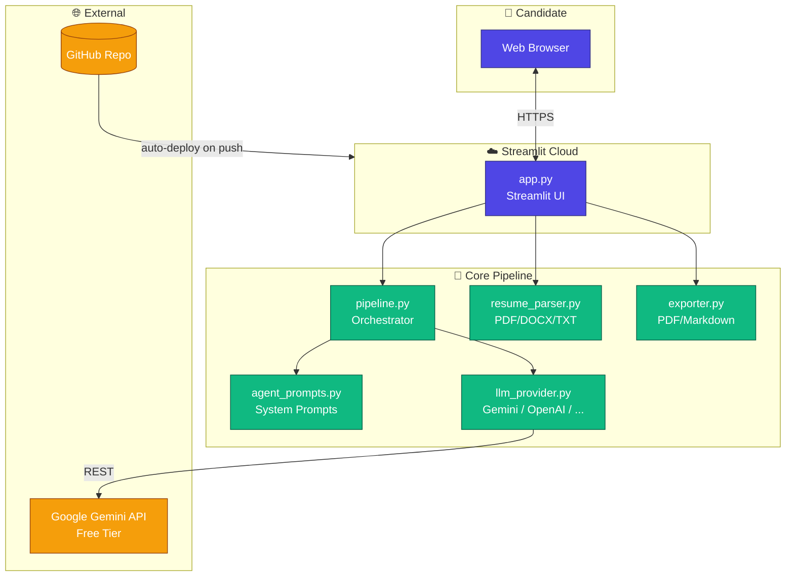
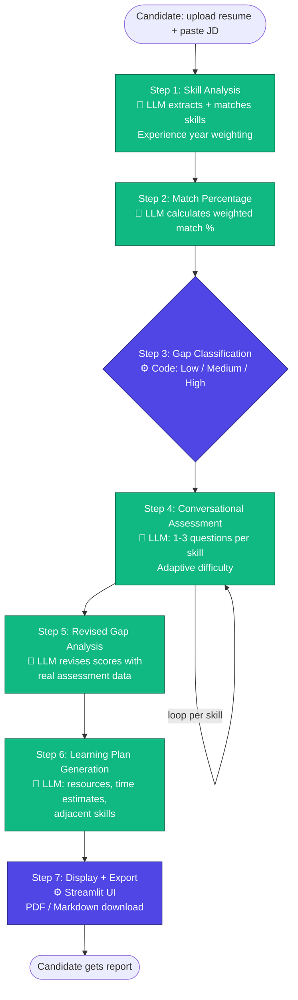

# Architecture

## System Overview



## The 7-Step Agent Flow



🤖 = LLM-powered step   ⚙️ = Deterministic code

## Scoring Logic

**Proficiency rubric (1-5):**

| Score | Label | Meaning |
|-------|-------|---------|
| 1 | Novice | No demonstrated knowledge |
| 2 | Basic Awareness | Recognises terminology, can't apply |
| 3 | Working Knowledge | Can explain and has applied in limited contexts |
| 4 | Strong Proficiency | Deep understanding, solves complex problems |
| 5 | Expert Mastery | Can teach others, architect solutions |

**Experience year weighting (Step 1):**

- Resume years == JD required years → full score (1.0)
- Resume years ≥ JD required + 1 → bonus (1.1)
- Resume years < JD required → proportional (years_have / years_required)
- No year info → score based on contextual evidence only

**Gap classification (Step 3):**

- Low gap: match < 50%  🔴
- Medium gap: 50% ≤ match ≤ 75%  🟡
- High gap: match > 75%  🟢

**Gap per skill (Step 5):**

- gap_size = max(0, JD_required - revised_score)
- 0 → "no_gap"
- 1 → "minor"
- 2 → "moderate"
- 3+ → "significant"

## Data Flow (per session)

All state lives in `st.session_state` — no database, no persistence between
sessions. The user's resume + JD never leave their browser session except to
make direct calls to the Gemini API.

```
st.session_state = {
  "step": "input" | "skill_overview" | "assessment" | "learning_plan",
  "jd_text": str,
  "resume_text": str,
  "skill_analysis": dict,           # Step 1 output
  "match_percentage": dict,          # Step 2 output
  "gap_classification": str,         # Step 3 output
  "assessment_state": dict,          # Step 4 running state
  "revised_analysis": dict,          # Step 5 output
  "learning_plan": dict,             # Step 6 output
  "api_key": str,
}
```
